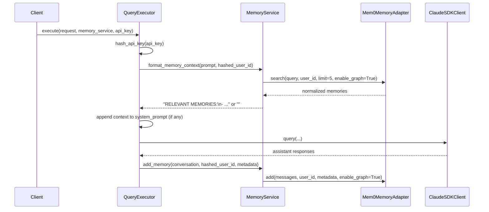
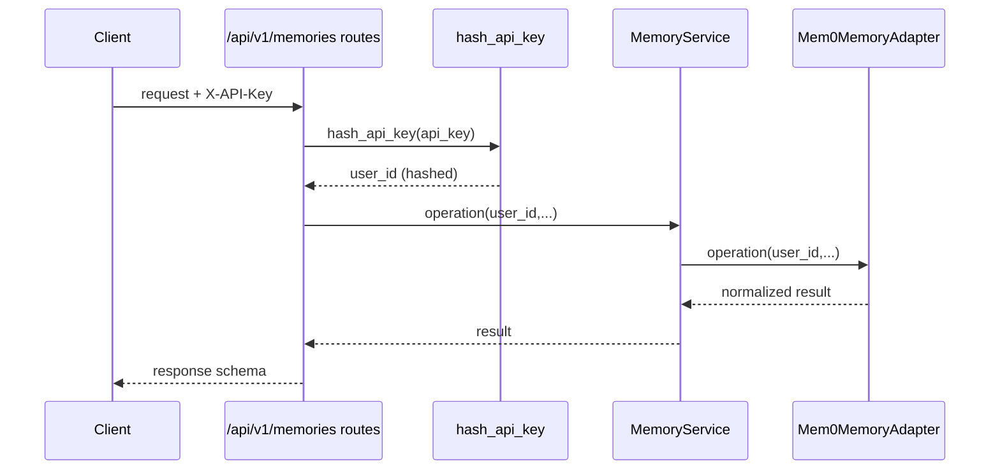

# Memory System Canonical Reference

## Purpose

This document is the source of truth for memory in this repository.
It describes the current implementation (not plan intent), data flow,
security model, configuration, test coverage, and file ownership.

Last verified against code on: 2026-02-07.

## Scope

This covers:

- Mem0 adapter and service abstractions
- `/api/v1/memories` CRUD/search API
- Automatic memory injection/extraction in query execution
- Multi-tenant isolation and API key hashing behavior
- Configuration and runtime workarounds
- Test coverage and gaps

This does not cover unrelated "memory" wording in third-party research
artifacts under `specs/agent-orchestration/*`.

## High-Level Architecture

```mermaid
flowchart LR
    Client[Client]
    Routes[/FastAPI Routes\n/api/v1/memories\n/api/v1/query*]
    Crypto[hash_api_key]
    Svc[MemoryService]
    Adapter[Mem0MemoryAdapter]
    Mem0[mem0.Memory]
    Qdrant[(Qdrant)]
    Neo4j[(Neo4j)]
    TEI[TEI Embeddings API]
    LLM[Configured LLM API]

    Client --> Routes
    Routes --> Crypto
    Crypto --> Svc
    Svc --> Adapter
    Adapter --> Mem0
    Mem0 --> Qdrant
    Mem0 --> Neo4j
    Mem0 --> TEI
    Mem0 --> LLM
```

## Query-Time Automatic Memory Flow



## Memory CRUD API Flow



## Components and Responsibilities

### 1. Protocol Contract

- `apps/api/protocols.py`
- `MemoryProtocol` defines async contract: `search`, `add`, `get_all`, `delete`,
  `delete_all`.

### 2. Adapter (Mem0 integration)

- `apps/api/adapters/memory.py`
- `Mem0MemoryAdapter` owns Mem0 config and response normalization.
- Uses `asyncio.to_thread(...)` for all Mem0 sync calls.
- Includes compatibility shims:
  - `_patch_langchain_neo4j()` for mem0/langchain-neo4j signature mismatch.
  - `supports_param(...)` checks before passing `enable_graph`.
- Normalizes response variants:
  - list vs dict wrappers (`results`, `memories`)
  - dict/string item coercion
  - strips `None` values from returned dicts
- Enforces ownership on delete:
  - calls `self._memory.get(memory_id=...)`
  - requires dict response
  - requires top-level `user_id == caller_user_id`
  - else raises `ValueError`

### 3. Service Layer

- `apps/api/services/memory.py`
- Thin orchestration wrapper over `MemoryProtocol`.
- Adds `format_memory_context(...)` for prompt injection format:
  - header `RELEVANT MEMORIES:`
  - bullet list of `- {memory_text}`

### 4. API Schemas and Routes

- Schemas: `apps/api/schemas/memory.py`
- Routes: `apps/api/routes/memories.py`
- Endpoints:
  - `POST /api/v1/memories/search`
  - `POST /api/v1/memories`
  - `GET /api/v1/memories`
  - `DELETE /api/v1/memories/{memory_id}`
  - `DELETE /api/v1/memories`
- All routes hash API key first (`hash_api_key`) and use hashed value as
  `user_id`.

### 5. DI + Lifecycle Wiring

- `apps/api/dependencies.py`
  - `get_memory_service()` is `@lru_cache` singleton factory.
  - uses `Mem0MemoryAdapter(settings)` -> `MemoryService(adapter)`.
- `apps/api/main.py`
  - includes memories router
  - sets `OPENAI_API_KEY` at startup if missing (workaround for Mem0 validation)

### 6. Query Integration

- `apps/api/services/agent/query_executor.py`
- Injection path:
  - `_inject_memory_context(...)` hashes API key, fetches formatted memories,
    appends to `system_prompt`.
- Extraction path:
  - `_extract_memory(...)` hashes API key, builds conversation transcript,
    stores via `memory_service.add_memory(...)`.
- Both are best-effort with warning logs on failure.

## Storage and Data Model

### Effective Storage Stack

- Vector memory: Qdrant
- Graph memory: Neo4j
- Embeddings API: TEI (OpenAI-compatible endpoint)
- Extraction LLM: configured OpenAI-compatible endpoint
- Mem0 internal history: SQLite (inferred from Mem0 behavior; not explicitly
  configured in this repository)

### Record Shapes (Normalized)

Search result shape (service-facing):

- `id: str`
- `memory: str`
- `score: float`
- `metadata: dict`

Add/list record shape (route-facing):

- required: `id`, `memory`
- optional: `hash`, `created_at`, `updated_at`, `user_id`, `agent_id`,
  `metadata`

## Configuration Source of Truth

Primary config fields:

- `apps/api/config.py`
- `.env.example`

Memory-related settings:

- `LLM_API_KEY`
- `LLM_BASE_URL`
- `LLM_MODEL`
- `NEO4J_URL`, `NEO4J_USERNAME`, `NEO4J_PASSWORD`, `NEO4J_DATABASE`
- `QDRANT_URL`
- `TEI_URL`
- `TEI_API_KEY` (placeholder semantics)
- `MEM0_COLLECTION_NAME`
- `MEM0_EMBEDDING_DIMS`
- `MEM0_AGENT_ID`

Runtime env workaround:

- `OPENAI_API_KEY` is populated at startup if absent (from `settings.tei_api_key`)
  because Mem0 validates OpenAI key even in this TEI embedder setup.

## Security Model

### Tenant Isolation

- API key is never used directly as memory `user_id` in routes/query execution.
- `hash_api_key(api_key)` is used as tenant identifier before memory operations.
- Isolation relies on Mem0 scoping with `user_id` and `agent_id`.

### Delete Authorization

- Adapter performs explicit ownership check before deleting a memory.
- If owner mismatch or malformed get response, raises `ValueError`.

### Security Hardening in this area

- Avoids plaintext API key storage in vector/graph metadata by hashing first.
- Neo4j APOC procedures restricted in `docker-compose.yaml` to required subset.

## Operational Behaviors and Caveats

1. `enable_graph` compatibility is dynamic.
If installed Mem0 method signature lacks `enable_graph`, adapter omits it.

2. Response normalization is intentionally defensive.
It tolerates multiple Mem0 response shapes and string/list variants.

3. Query memory steps are fail-open for user experience.
Failures in inject/extract log warning and query continues.

4. Delete failure semantics need explicit API mapping.
`ValueError` from adapter is not converted in `routes/memories.py`; behavior
currently depends on global exception handling and may surface as 500.

5. Ownership check currently reads top-level `memory_data["user_id"]`.
If a backend/provider puts ownership only in nested metadata, delete may reject
valid owner (safe-fail).

## Test Coverage Map

### Core Unit Coverage

- `tests/unit/adapters/test_memory_adapter.py`
  - config init, langchain shim, `enable_graph` introspection fallback,
    response normalization, delete authorization checks
- `tests/unit/services/test_memory_service.py`
  - all service methods, context formatting, graph flag propagation
- `tests/unit/schemas/test_memory_schemas.py`
  - request/response schema validation and defaults
- `tests/unit/test_memory_config.py`
- `tests/unit/test_memory_protocol.py`
- `tests/unit/test_memory_dependencies.py`

### Integration Coverage

- `tests/integration/routes/test_memories.py`
  - route contract with mocked memory service
- `tests/integration/test_query_memory_integration.py`
  - inject/extract behavior in `QueryExecutor`
- `tests/integration/test_memory_isolation.py`
  - real dependency test for tenant isolation and cross-user delete prevention
  - gated by `RUN_MEM0_INTEGRATION` and live service availability

## Complete Memory File Inventory (Repository)

Implementation/runtime files:

- `apps/api/adapters/memory.py`
- `apps/api/services/memory.py`
- `apps/api/routes/memories.py`
- `apps/api/schemas/memory.py`
- `apps/api/protocols.py`
- `apps/api/dependencies.py`
- `apps/api/config.py`
- `apps/api/main.py`
- `apps/api/utils/crypto.py`
- `apps/api/utils/introspection.py`
- `apps/api/services/agent/query_executor.py`
- `apps/api/services/agent/stream_query_runner.py`
- `apps/api/services/agent/single_query_runner.py`
- `apps/api/services/agent/service.py`
- `apps/api/services/agent/config.py`

Tests:

- `tests/unit/adapters/test_memory_adapter.py`
- `tests/unit/services/test_memory_service.py`
- `tests/unit/schemas/test_memory_schemas.py`
- `tests/unit/test_memory_config.py`
- `tests/unit/test_memory_dependencies.py`
- `tests/unit/test_memory_protocol.py`
- `tests/unit/test_config.py` (memory-related settings coverage)
- `tests/unit/test_dependencies.py` (DI lifecycle context)
- `tests/integration/routes/test_memories.py`
- `tests/integration/test_query_memory_integration.py`
- `tests/integration/test_memory_isolation.py`
- `tests/integration/test_api_key_hashing.py`
- `tests/integration/test_session_service_hashing.py`
- `tests/unit/services/agent/test_single_query_runner.py`
- `tests/unit/services/agent/test_stream_query_runner.py`
- `tests/unit/utils/test_crypto.py`
- `tests/conftest.py` (memory singleton reset)

Adjacent/cross-cutting files (not Mem0-specific, but impact tenant hashing,
ownership, or memory-adjacent behavior):

- `apps/api/adapters/session_repo.py`
- `apps/api/routes/sessions.py`
- `apps/api/services/session.py`
- `apps/api/services/assistants/assistant_service.py`
- `tests/integration/test_session_repository.py`
- `tests/unit/test_session_security.py`
- `tests/unit/test_session_service.py`

User-facing docs/config touching memory:

- `README.md` (Memory API quickstart)
- `CLAUDE.md` (Mem0 section)
- `.env.example` (memory env vars)
- `docker-compose.yaml` (Neo4j for graph memory)

Planning/history docs (not canonical runtime truth):

- `docs/plans/2026-02-03-mem0-oss-integration.md`
- `docs/plans/2026-02-03-mem0-oss-integration-part2.md`
- `docs/plans/2026-02-01-phase-3-drop-plaintext-api-keys.md`
- `docs/plans/2026-02-05-agentservice-config-migration.md`

Spec/research artifacts mentioning memory (non-authoritative for this system):

- `specs/agent-orchestration/openclaw-memory-docs.md`
- `specs/agent-orchestration/clarification-memory.md`
- `specs/agent-orchestration/clarification-skills-memory.md`
- `specs/agent-orchestration/AGENT-README.md`
- `specs/agent-orchestration/plan.md`

## Recommended Canonical Policy

Use this file (`docs/memory.md`) as the only canonical memory reference.

Recommended next cleanups:

- Keep `README.md` memory section as quickstart only, link here for details.
- Keep `CLAUDE.md` memory section high-level, link here for implementation truth.
- Treat `docs/plans/*mem0*` as historical planning artifacts.
