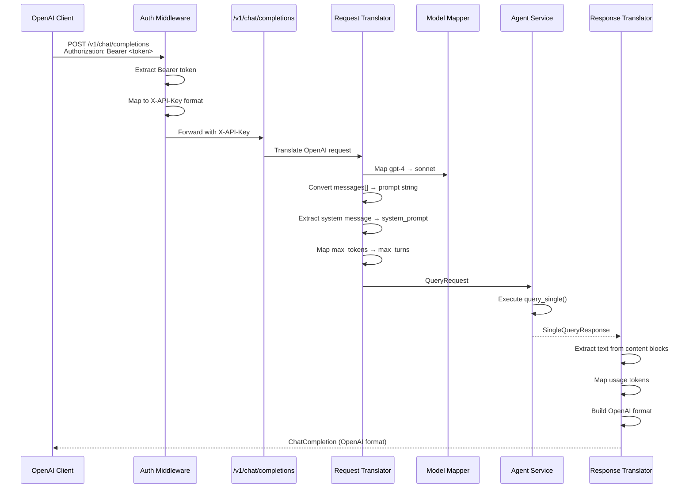
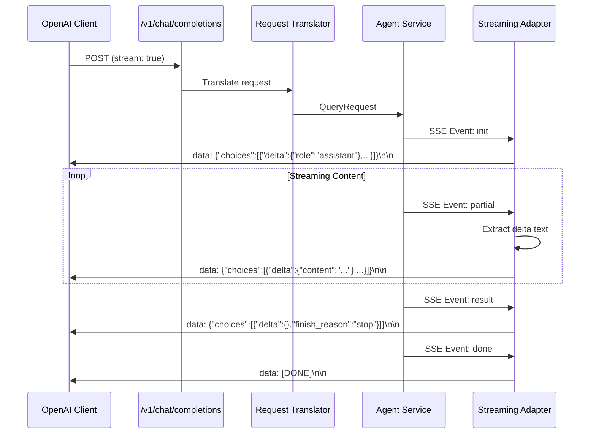

# Technical Design: OpenAI API Compatibility

## Overview

This design implements an OpenAI-compatible API layer at `/v1/chat/completions` that translates OpenAI request/response formats to the existing Claude Agent API's native format. The translation layer is completely isolated in new route handlers and service modules, maintaining zero impact on existing `/api/v1` endpoints. The architecture follows existing patterns: protocol-based dependency injection, Pydantic schema validation, SSE streaming via sse-starlette, and strict type safety with TypedDict for all JSON structures.

## Architecture

```mermaid
graph TB
    subgraph "Client Layer"
        OAI[OpenAI Python Client]
    end

    subgraph "API Gateway (/v1)"
        AUTH[Auth Middleware<br/>Bearer Token → X-API-Key]
        CHAT[/v1/chat/completions]
        MODELS[/v1/models]
    end

    subgraph "Translation Layer"
        REQ_TRANS[Request Translator<br/>OpenAI → QueryRequest]
        RESP_TRANS[Response Translator<br/>SingleQueryResponse → OpenAI]
        STREAM_TRANS[Streaming Adapter<br/>SSE Events → OpenAI Chunks]
        MODEL_MAP[Model Mapper<br/>gpt-4 → sonnet]
        ERROR_TRANS[Error Translator<br/>APIError → OpenAI Error]
    end

    subgraph "Existing Services (Unchanged)"
        AGENT[Agent Service]
        SESSION[Session Service]
        ENRICH[Query Enrichment]
    end

    subgraph "Storage (Unchanged)"
        REDIS[(Redis Cache)]
        POSTGRES[(PostgreSQL)]
    end

    OAI -->|POST /v1/chat/completions| AUTH
    AUTH --> CHAT
    AUTH --> MODELS

    CHAT -->|stream: false| REQ_TRANS
    CHAT -->|stream: true| REQ_TRANS

    REQ_TRANS --> MODEL_MAP
    REQ_TRANS --> ENRICH
    ENRICH --> AGENT

    AGENT -->|Non-streaming| RESP_TRANS
    AGENT -->|Streaming SSE| STREAM_TRANS

    RESP_TRANS -->|OpenAI Format| OAI
    STREAM_TRANS -->|OpenAI Chunks| OAI

    AGENT --> SESSION
    SESSION --> REDIS
    SESSION --> POSTGRES

    CHAT -.->|On Error| ERROR_TRANS
    ERROR_TRANS -.->|OpenAI Error| OAI
```

## Request/Response Flow

### Non-Streaming Flow



### Streaming Flow



## Component Design

### Component: Request Translator (`apps/api/services/openai/translator.py`)

**Purpose**: Convert OpenAI ChatCompletionRequest to native QueryRequest format.

**Responsibilities**:
- Parse OpenAI messages array into single prompt string (concatenate with role prefixes for new sessions)
- Extract system messages as `system_prompt` field
- Map OpenAI model names to Claude model names (via ModelMapper)
- **Accept but ignore** `max_tokens` completely (incompatible with max_turns - different semantics)
- **Accept but log warnings** for unsupported parameters (temperature, top_p, stop - SDK doesn't support)
- Pass through `user` parameter (SUPPORTED by SDK via QueryRequest.user field)
- Handle session management: new conversation vs resume existing session (Redis mapping)

**Interfaces**:
```python
from typing import Protocol

class OpenAIChatRequest(TypedDict):
    """OpenAI chat completion request structure.

    NOTE: TypedDict definitions should be in apps/api/types.py (extend existing file),
    NOT in schemas/openai/ directory.
    """
    model: Required[str]
    messages: Required[list[OpenAIMessage]]
    # SDK does NOT support these - accept for compatibility, log warnings:
    temperature: NotRequired[float]  # NOT SUPPORTED by SDK
    max_tokens: NotRequired[int]     # NOT SUPPORTED - ignore completely
    top_p: NotRequired[float]        # NOT SUPPORTED by SDK
    stop: NotRequired[list[str]]     # NOT SUPPORTED by SDK
    stream: NotRequired[bool]
    user: NotRequired[str]           # SUPPORTED - maps to QueryRequest.user
    # Additional fields as NotRequired...

class OpenAIMessage(TypedDict):
    """OpenAI message structure."""
    role: Required[Literal["system", "user", "assistant"]]
    content: Required[str]

class RequestTranslator:
    """Translates OpenAI requests to QueryRequest."""

    def __init__(self, model_mapper: ModelMapper) -> None:
        """Initialize with model mapper dependency."""
        ...

    def translate(self, openai_request: OpenAIChatRequest) -> QueryRequest:
        """Convert OpenAI request to QueryRequest.

        Args:
            openai_request: OpenAI format request

        Returns:
            Translated QueryRequest

        Raises:
            ValidationError: If required fields missing or invalid
        """
        ...
```

**Dependencies**: ModelMapper (for model name translation)

### Component: Response Translator (`apps/api/services/openai/translator.py`)

**Purpose**: Convert native SingleQueryResponse to OpenAI ChatCompletion format.

**Responsibilities**:
- Extract text content from content blocks (concatenate all text blocks)
- Map usage statistics (input_tokens → prompt_tokens, output_tokens → completion_tokens)
- Generate OpenAI-compatible completion ID (chatcmpl-<uuid>)
- Map stop_reason to finish_reason (completed → stop, max_turns_reached → length, error → error)
- Build choices array with single message
- Add created timestamp (Unix epoch)

**Interfaces**:
```python
class OpenAIChatCompletion(TypedDict):
    """OpenAI chat completion response structure."""
    id: Required[str]
    object: Required[Literal["chat.completion"]]
    created: Required[int]
    model: Required[str]
    choices: Required[list[OpenAIChoice]]
    usage: Required[OpenAIUsage]

class OpenAIChoice(TypedDict):
    """OpenAI choice structure."""
    index: Required[int]
    message: Required[OpenAIResponseMessage]
    finish_reason: Required[Literal["stop", "length", "error"] | None]

class OpenAIResponseMessage(TypedDict):
    """OpenAI response message structure."""
    role: Required[Literal["assistant"]]
    content: Required[str]

class OpenAIUsage(TypedDict):
    """OpenAI usage statistics."""
    prompt_tokens: Required[int]
    completion_tokens: Required[int]
    total_tokens: Required[int]

class ResponseTranslator:
    """Translates SingleQueryResponse to OpenAI format."""

    def translate(
        self,
        response: SingleQueryResponse,
        original_model: str
    ) -> OpenAIChatCompletion:
        """Convert SingleQueryResponse to OpenAI completion.

        Args:
            response: Native query response
            original_model: Original OpenAI model name from request

        Returns:
            OpenAI format completion
        """
        ...
```

**Dependencies**: None (pure translation)

### Component: Streaming Adapter (`apps/api/services/openai/streaming.py`)

**Purpose**: Transform native SSE events to OpenAI streaming chunk format.

**Responsibilities**:
- Convert init event to role delta chunk (`{"delta": {"role": "assistant"}}`)
- Convert partial events to content delta chunks (`{"delta": {"content": "text"}}`)
- Convert result event to finish chunk (`{"delta": {}, "finish_reason": "stop"}`)
- Emit `[DONE]` marker at stream end
- Handle error events by emitting error chunk then closing stream
- Track state to ensure proper chunk sequencing

**Interfaces**:
```python
class OpenAIStreamChunk(TypedDict):
    """OpenAI streaming chunk structure."""
    id: Required[str]
    object: Required[Literal["chat.completion.chunk"]]
    created: Required[int]
    model: Required[str]
    choices: Required[list[OpenAIStreamChoice]]

class OpenAIStreamChoice(TypedDict):
    """OpenAI streaming choice structure."""
    index: Required[int]
    delta: Required[OpenAIDelta]
    finish_reason: Required[Literal["stop", "length", "error"] | None]

class OpenAIDelta(TypedDict):
    """OpenAI delta content structure."""
    role: NotRequired[Literal["assistant"]]
    content: NotRequired[str]

class StreamingAdapter:
    """Adapts native SSE events to OpenAI streaming format."""

    def __init__(self, original_model: str) -> None:
        """Initialize with original model name for responses."""
        ...

    async def adapt_stream(
        self,
        native_events: AsyncGenerator[dict[str, str], None]
    ) -> AsyncGenerator[dict[str, str], None]:
        """Transform native SSE events to OpenAI chunks.

        Args:
            native_events: Native SSE event generator

        Yields:
            OpenAI format SSE events (data: json\n\n format)
        """
        ...
```

**Dependencies**: None (stateful adapter with internal tracking)

### Component: Model Mapper (`apps/api/services/openai/models.py`)

**Purpose**: Map between OpenAI model names and Claude model names.

**Responsibilities**:
- Provide bidirectional mapping (OpenAI ↔ Claude)
- Load configuration from YAML file or dict
- Validate model names exist in mapping
- Return list of available OpenAI model names

**Interfaces**:
```python
class ModelInfo(TypedDict):
    """Model information structure."""
    id: Required[str]
    object: Required[Literal["model"]]
    created: Required[int]
    owned_by: Required[str]

class ModelMapper:
    """Maps OpenAI model names to Claude model names."""

    def __init__(self, mapping: dict[str, str]) -> None:
        """Initialize with model name mapping.

        Args:
            mapping: Dict mapping OpenAI names to Claude names
                    Example: {"gpt-4": "sonnet", "gpt-3.5-turbo": "haiku"}
        """
        ...

    def to_claude(self, openai_model: str) -> str:
        """Map OpenAI model name to Claude model name.

        Args:
            openai_model: OpenAI model name (e.g., "gpt-4")

        Returns:
            Claude model name (e.g., "sonnet")

        Raises:
            ValueError: If model not in mapping
        """
        ...

    def to_openai(self, claude_model: str) -> str:
        """Map Claude model name to OpenAI model name.

        Args:
            claude_model: Claude model name (e.g., "sonnet")

        Returns:
            OpenAI model name (e.g., "gpt-4")

        Raises:
            ValueError: If model not in mapping
        """
        ...

    def list_models(self) -> list[ModelInfo]:
        """List all available models in OpenAI format.

        Returns:
            List of model info dicts
        """
        ...
```

**Dependencies**: Configuration file (YAML or dict injection)

### Component: Error Translator (`apps/api/services/openai/errors.py`)

**Purpose**: Convert internal APIError exceptions to OpenAI error format.

**Responsibilities**:
- Map HTTP status codes to OpenAI error types
- Preserve error message and details
- Generate OpenAI error response structure
- Handle validation errors separately (map Pydantic ValidationError)

**Interfaces**:
```python
class OpenAIError(TypedDict):
    """OpenAI error structure."""
    error: Required[OpenAIErrorDetails]

class OpenAIErrorDetails(TypedDict):
    """OpenAI error details structure."""
    message: Required[str]
    type: Required[str]  # "invalid_request_error", "authentication_error", etc.
    code: Required[str | None]

class ErrorTranslator:
    """Translates APIError to OpenAI error format."""

    @staticmethod
    def translate(error: APIError) -> OpenAIError:
        """Convert APIError to OpenAI error format.

        Args:
            error: Internal API error

        Returns:
            OpenAI format error
        """
        ...

    @staticmethod
    def translate_validation_error(error: ValidationError) -> OpenAIError:
        """Convert Pydantic ValidationError to OpenAI format.

        Args:
            error: Pydantic validation error

        Returns:
            OpenAI format error with type "invalid_request_error"
        """
        ...
```

**Dependencies**: None (pure translation)

### Component: Bearer Auth Middleware (`apps/api/middleware/openai_auth.py`)

**Purpose**: Extract Bearer token and map to internal X-API-Key format.

**Responsibilities**:
- Parse `Authorization: Bearer <token>` header
- Validate token format (non-empty, no whitespace)
- Map to `X-API-Key` header for existing auth middleware
- Maintain backward compatibility (still accept X-API-Key directly)

**Interfaces**:
```python
class BearerAuthMiddleware(BaseHTTPMiddleware):
    """Middleware to support Bearer token authentication for OpenAI compatibility."""

    async def dispatch(
        self,
        request: Request,
        call_next: RequestResponseEndpoint,
    ) -> Response:
        """Process request and extract Bearer token.

        If Authorization: Bearer <token> header exists, extract token
        and set X-API-Key header for downstream auth middleware.

        Args:
            request: Incoming request
            call_next: Next middleware/handler

        Returns:
            Response from next handler
        """
        ...
```

**Dependencies**: Starlette Request/Response

### Component: Chat Completions Route (`apps/api/routes/openai/chat.py`)

**Purpose**: Handle `/v1/chat/completions` endpoint for both streaming and non-streaming.

**Responsibilities**:
- Validate incoming OpenAI request
- Delegate to RequestTranslator
- Route to streaming or non-streaming based on `stream` parameter
- Delegate response translation
- Handle errors with ErrorTranslator

**Interfaces**:
```python
from fastapi import APIRouter, Request

router = APIRouter(prefix="/chat", tags=["OpenAI"])

@router.post("/completions")
async def create_chat_completion(
    request: Request,
    body: OpenAIChatRequest,  # Pydantic model validating OpenAI schema
    _api_key: ApiKey,
    agent_service: AgentSvc,
    session_service: SessionSvc,
    enrichment_service: QueryEnrichment,
) -> OpenAIChatCompletion | EventSourceResponse:
    """Create a chat completion (OpenAI compatible).

    Supports both streaming and non-streaming modes.

    Args:
        request: FastAPI request
        body: OpenAI format request
        _api_key: Validated API key (via dependency)
        agent_service: Agent service instance
        session_service: Session service instance
        enrichment_service: Query enrichment service

    Returns:
        OpenAI format completion or SSE stream
    """
    ...
```

**Dependencies**: AgentService, SessionService, QueryEnrichmentService, RequestTranslator, ResponseTranslator, StreamingAdapter, ErrorTranslator

### Component: Models Route (`apps/api/routes/openai/models.py`)

**Purpose**: Handle `/v1/models` endpoints for model discovery.

**Responsibilities**:
- List available models in OpenAI format
- Return specific model details by ID
- Return 404 for unknown model IDs

**Interfaces**:
```python
router = APIRouter(prefix="/models", tags=["OpenAI"])

@router.get("")
async def list_models() -> OpenAIModelList:
    """List available models.

    Returns:
        List of models in OpenAI format
    """
    ...

@router.get("/{model_id}")
async def get_model(model_id: str) -> ModelInfo:
    """Get specific model details.

    Args:
        model_id: OpenAI model ID

    Returns:
        Model info

    Raises:
        HTTPException: 404 if model not found
    """
    ...
```

**Dependencies**: ModelMapper

## Data Flow

### Message Array to Prompt Conversion

1. Extract all messages with role="system" → concatenate as `system_prompt`
2. For remaining messages (user, assistant):
   - Format: `"{role.upper()}: {content}\n\n"`
   - Example: `"USER: Hello\n\nASSISTANT: Hi there!\n\nUSER: How are you?\n\n"`
3. Trim trailing whitespace
4. Pass to QueryRequest.prompt field

### Token to Turn Conversion

- **SDK Research Finding**: Ignore max_tokens completely (incompatible semantics - output tokens vs conversation turns)
- Do NOT set max_turns based on max_tokens - let SDK use default turn limit
- Rationale: Average turn uses ~500 tokens (prompt + response)
- Logged at DEBUG level for monitoring

### Content Block to Text Extraction

1. Iterate through SingleQueryResponse.content list
2. For each block with type="text", extract text field
3. Concatenate all text blocks with single space separator
4. Return as OpenAI message.content

### Usage Mapping

| Native Field | OpenAI Field | Notes |
|--------------|--------------|-------|
| usage.input_tokens | usage.prompt_tokens | Direct mapping |
| usage.output_tokens | usage.completion_tokens | Direct mapping |
| (calculated) | usage.total_tokens | Sum of prompt + completion |
| usage.cache_read_input_tokens | (ignored) | Not in OpenAI schema |

### Stop Reason Mapping

| Native stop_reason | OpenAI finish_reason | Description |
|--------------------|---------------------|-------------|
| "completed" | "stop" | Normal completion |
| "max_turns_reached" | "length" | Hit turn limit |
| "interrupted" | "stop" | User interrupted (treat as stop) |
| "error" | "error" | Error occurred |
| null | null | Still generating (streaming) |

## Technical Decisions

| Decision | Options Considered | Choice | Rationale |
|----------|-------------------|--------|-----------|
| Route namespace | `/openai/*`, `/v1/*`, `/api/v1/openai/*` | `/v1/*` | Matches OpenAI's official namespace, simplifies client configuration (base_url = "http://host/v1") |
| Translation location | Middleware, Route handlers, Service layer | Service layer | Follows existing pattern of protocol-based services, easier to test and maintain |
| Model mapping config | Hardcoded dict, YAML file, Database | Hardcoded dict (injectable) | Simple, fast, version-controlled. Can evolve to YAML if needed |
| Authentication strategy | Replace existing middleware, Add new middleware, Extend existing | Add new middleware (BearerAuthMiddleware) | Zero impact on existing auth, easy to toggle, follows middleware pattern |
| Streaming adapter state | Stateless generator, Stateful class, Closure | Stateful class | Clean interface, testable, can track completion ID and creation time |
| Error handling | Try/catch in routes, Exception handlers, Translator | Exception handlers + Translator | Reuse existing exception handler pattern, centralized translation |
| Message concatenation | Join with newlines, Join with role prefixes, Template-based | Role prefixes (`USER: ...\n\n`) | Clear role boundaries, compatible with prompt expectations |
| max_tokens handling | Ignore completely, Log warning, Return error | **Ignore completely** | SDK Research: max_tokens (output token limit) vs max_turns (conversation turns) have incompatible semantics. Accept for compatibility, log WARNING, do NOT set max_turns |
| Validation strategy | Pydantic models, TypedDict runtime, Manual | **Pydantic for requests, TypedDict for responses** | Pydantic: runtime validation for untrusted input. TypedDict: zero overhead for internal/output data. Existing pattern in apps/api/ |
| Session management | Create new sessions, Reuse session_id, Stateless | Reuse session_id if provided | Maintains conversation continuity, compatible with SDK expectations |

## File Structure

| File | Action | Purpose |
|------|--------|---------|
| `apps/api/routes/openai/__init__.py` | Create | Package init |
| `apps/api/routes/openai/chat.py` | Create | Chat completions endpoint |
| `apps/api/routes/openai/models.py` | Create | Models list endpoint |
| `apps/api/schemas/openai/__init__.py` | Create | Package init |
| `apps/api/schemas/openai/requests.py` | Create | OpenAI request schemas (Pydantic) |
| `apps/api/types.py` | **Extend existing** | Add OpenAI TypedDict definitions (NOT in schemas/openai/). Pydantic requests go in schemas/openai/requests.py |
| `apps/api/services/openai/__init__.py` | Create | Package init |
| `apps/api/services/openai/translator.py` | Create | Request/response translator |
| `apps/api/services/openai/streaming.py` | Create | Streaming adapter |
| `apps/api/services/openai/models.py` | Create | Model mapper |
| `apps/api/services/openai/errors.py` | Create | Error translator |
| `apps/api/middleware/openai_auth.py` | Create | Bearer token auth middleware |
| `apps/api/main.py` | Modify | Register OpenAI routes and middleware |
| `tests/unit/services/openai/test_translator.py` | Create | Unit tests for translation |
| `tests/unit/services/openai/test_streaming.py` | Create | Unit tests for streaming adapter |
| `tests/unit/services/openai/test_models.py` | Create | Unit tests for model mapper |
| `tests/unit/services/openai/test_errors.py` | Create | Unit tests for error translator |
| `tests/integration/test_openai_chat.py` | Create | Integration tests for chat endpoint |
| `tests/integration/test_openai_models.py` | Create | Integration tests for models endpoint |
| `tests/contract/test_openai_compliance.py` | Create | Contract tests using OpenAI client |

## Error Handling

### Error Mapping Table

| Error Scenario | Internal Error | HTTP Status | OpenAI Error Type | Handling Strategy |
|----------------|----------------|-------------|------------------|-------------------|
| Missing API key | AuthenticationError | 401 | authentication_error | Middleware catches, returns OpenAI error |
| Invalid API key | AuthenticationError | 401 | authentication_error | Middleware catches, returns OpenAI error |
| Invalid request body | ValidationError | 400 | invalid_request_error | Exception handler translates Pydantic error |
| Unknown model name | ValueError | 400 | invalid_request_error | Caught in RequestTranslator, wrapped |
| Missing required field | ValidationError | 400 | invalid_request_error | Pydantic validation, translated |
| Agent service error | APIError | 500 | api_error | Exception handler translates |
| Session not found | SessionNotFoundError | 404 | invalid_request_error | Caught in route, translated |
| Rate limit exceeded | RateLimitError | 429 | rate_limit_exceeded | Middleware catches, translated |
| Request timeout | TimeoutError | 408 | timeout_error | Existing handler, add translation |
| Internal server error | Exception | 500 | api_error | Existing handler, add translation |

### Exception Handler Strategy

Add new exception handler in `main.py` for OpenAI routes:

```python
@app.exception_handler(ValidationError)
async def validation_error_handler(request: Request, exc: ValidationError) -> JSONResponse:
    """Handle Pydantic validation errors for OpenAI routes."""
    if request.url.path.startswith("/v1/"):
        # Translate to OpenAI format
        openai_error = ErrorTranslator.translate_validation_error(exc)
        return JSONResponse(status_code=400, content=openai_error)
    # Fall through to default handler for non-OpenAI routes
    ...
```

## Edge Cases

- **Empty message array**: Return 400 error "messages array must contain at least one message"
- **Only system messages**: Extract as system_prompt, but prompt="" will fail validation. Return 400 "must include at least one user message"
- **Message with empty content**: Allow (some clients send empty user message to prime assistant response)
- **Model name not in mapping**: Return 400 error with list of valid models in details
- **max_tokens (any value)**: Accept for compatibility, log WARNING "max_tokens not supported by SDK", do NOT set max_turns
- **temperature (any value)**: Accept for compatibility, log WARNING "temperature not supported by SDK"
- **top_p, stop**: Accept for compatibility, log WARNING as unsupported
- **user**: Pass through to QueryRequest.user (SUPPORTED by SDK)
- **Streaming with session_id**: Support resuming streaming sessions (SDK handles state)
- **Multiple system messages**: Concatenate with "\n\n" separator
- **Non-text content blocks**: Ignore thinking/tool_use blocks when extracting response text
- **Usage data missing**: Return zeros for all usage fields (prompt_tokens=0, completion_tokens=0, total_tokens=0)
- **Very long messages array**: Check total length against max_prompt_length setting, return 400 if exceeded

## Test Strategy

### Unit Tests (`tests/unit/services/openai/`)

**Request Translator Tests**:
- `test_translate_basic_request`: Simple user message → QueryRequest (verify prompt field)
- `test_translate_with_system_message`: System message extracted to system_prompt
- `test_translate_multiple_messages`: Message array concatenation with role prefixes
- `test_translate_model_mapping`: gpt-4 → sonnet, gpt-3.5-turbo → haiku
- `test_translate_max_tokens_conversion`: Various max_tokens values → max_turns
- `test_translate_temperature_passthrough`: Temperature parameter preserved
- `test_translate_user_field`: User identifier mapped correctly
- `test_translate_missing_model`: Raises ValidationError
- `test_translate_empty_messages`: Raises ValidationError
- `test_translate_unknown_model`: Raises ValueError with model list

**Response Translator Tests**:
- `test_translate_basic_response`: SingleQueryResponse → OpenAI completion
- `test_translate_usage_mapping`: Token counts mapped correctly
- `test_translate_stop_reason_mapping`: All stop reasons → finish_reason
- `test_translate_content_extraction`: Text blocks concatenated
- `test_translate_completion_id_format`: ID matches chatcmpl-<uuid> pattern
- `test_translate_timestamp`: Created timestamp is valid Unix epoch
- `test_translate_no_content_blocks`: Empty content → empty string
- `test_translate_mixed_content_blocks`: Only text blocks extracted

**Streaming Adapter Tests**:
- `test_adapt_init_event`: Init → role delta chunk
- `test_adapt_partial_events`: Partial → content delta chunks
- `test_adapt_result_event`: Result → finish chunk with stop
- `test_adapt_done_event`: Done → [DONE] marker
- `test_adapt_error_event`: Error → error chunk
- `test_adapt_complete_stream`: Full stream sequence validates
- `test_adapt_completion_id_consistency`: Same ID across all chunks
- `test_adapt_chunk_format`: Each chunk matches OpenAI schema

**Model Mapper Tests**:
- `test_to_claude_basic`: gpt-4 → sonnet
- `test_to_openai_basic`: sonnet → gpt-4
- `test_to_claude_unknown`: Raises ValueError
- `test_list_models_format`: Returns valid ModelInfo list
- `test_list_models_count`: Matches mapping size
- `test_bidirectional_mapping`: to_claude ∘ to_openai = identity

**Error Translator Tests**:
- `test_translate_api_error`: APIError → OpenAI error
- `test_translate_validation_error`: ValidationError → OpenAI error
- `test_error_type_mapping_401`: 401 → authentication_error
- `test_error_type_mapping_400`: 400 → invalid_request_error
- `test_error_type_mapping_429`: 429 → rate_limit_exceeded
- `test_error_type_mapping_500`: 500 → api_error
- `test_error_message_preserved`: Original message not lost
- `test_error_details_preserved`: Details dict included

**Coverage Target**: ≥90% line coverage for all translator modules

### Integration Tests (`tests/integration/`)

**Chat Endpoint Tests** (`test_openai_chat.py`):
- `test_chat_completion_basic`: POST with simple message, validates response schema
- `test_chat_completion_streaming`: POST with stream=true, validates SSE chunks
- `test_chat_completion_with_system_message`: System message handling
- `test_chat_completion_with_history`: Multi-turn conversation
- `test_chat_completion_model_mapping`: Different model names
- `test_chat_completion_with_max_tokens`: max_tokens accepted and ignored (verify NOT converted to max_turns)
- `test_chat_completion_auth_bearer`: Bearer token authentication
- `test_chat_completion_auth_x_api_key`: X-API-Key still works
- `test_chat_completion_no_auth`: Returns 401
- `test_chat_completion_invalid_model`: Returns 400 with error
- `test_chat_completion_empty_messages`: Returns 400 with error
- `test_chat_completion_rate_limit`: Rate limiting applies

**Models Endpoint Tests** (`test_openai_models.py`):
- `test_list_models`: GET /v1/models returns valid list
- `test_list_models_format`: Response matches OpenAI schema
- `test_get_model_by_id`: GET /v1/models/gpt-4 returns model info
- `test_get_model_not_found`: GET /v1/models/invalid returns 404

**Coverage Target**: ≥80% line coverage for route handlers

### Contract Tests (`tests/contract/`)

**OpenAI Client Compliance** (`test_openai_compliance.py`):
- `test_openai_client_basic`: Use official OpenAI Python client with base_url override
- `test_openai_client_streaming`: Streaming via OpenAI client
- `test_openai_client_error_handling`: Error responses parseable by client
- `test_openai_response_schema`: Response matches OpenAI spec exactly
- `test_openai_streaming_schema`: Streaming chunks match OpenAI spec exactly

**Test Setup**:
```python
from openai import OpenAI

client = OpenAI(
    base_url="http://localhost:54000/v1",
    api_key="test-key",
)

response = client.chat.completions.create(
    model="gpt-4",
    messages=[{"role": "user", "content": "Hello"}],
)
assert response.choices[0].message.content is not None
```

**Coverage Target**: 100% schema compliance for supported fields

### E2E Tests (Manual/Automated)

- Test with LangChain using OpenAI provider
- Test with Cursor IDE configured to use custom OpenAI endpoint
- Test with Continue.dev configured to use custom OpenAI endpoint
- Load test streaming performance (latency targets)

## Performance Considerations

### Translation Latency Targets

| Operation | Target P95 Latency | Measurement Point |
|-----------|-------------------|-------------------|
| Request translation | <5ms | RequestTranslator.translate() |
| Response translation | <10ms | ResponseTranslator.translate() |
| Streaming first chunk | <50ms | Time from init event to first OpenAI chunk |
| Model name lookup | <1ms | ModelMapper.to_claude() |
| Error translation | <2ms | ErrorTranslator.translate() |

### Optimization Strategies

1. **Model Mapping**: Use dict lookup (O(1)), precompute at startup
2. **Message Concatenation**: Use list comprehension + join (faster than += in loop)
3. **Content Extraction**: Single-pass iteration over content blocks
4. **Streaming**: Async generator, no buffering (yield as soon as event arrives)
5. **Validation**: Pydantic models compiled at startup, minimal runtime overhead

### Monitoring Metrics

- `openai_translation_request_duration_seconds` (histogram) - Request translation time
- `openai_translation_response_duration_seconds` (histogram) - Response translation time
- `openai_streaming_first_chunk_duration_seconds` (histogram) - First chunk latency
- `openai_requests_total` (counter, labels: model, stream, status) - Total requests
- `openai_errors_total` (counter, labels: error_type) - Errors by type

## Security Considerations

### Authentication Security

- Bearer token extraction uses constant-time comparison (secrets.compare_digest)
- Token passed to existing X-API-Key validation (no new auth logic)
- No token logging or exposure in responses
- Same rate limiting applies to OpenAI endpoints

### Input Validation

- Pydantic models validate all fields before translation
- Message content length checked against max_prompt_length setting
- Model names validated against whitelist
- No arbitrary code execution in translation layer

### Error Disclosure

- Internal error details not exposed in OpenAI errors
- Stack traces only in debug mode
- Generic "api_error" for unexpected exceptions
- Correlation IDs for debugging without exposing internals

## Existing Patterns to Follow

Based on codebase analysis, the implementation must follow these patterns:

### Protocol-Based Dependency Injection
```python
# Define protocols in apps/api/protocols/openai.py (NEW FILE for OpenAI-specific protocols)
# Do NOT add to existing apps/api/protocols.py - keep clean separation
class RequestTranslatorProtocol(Protocol):
    """Protocol for OpenAI request translation."""
    def translate(self, request: OpenAIChatRequest) -> QueryRequest: ...

# Concrete implementation in apps/api/services/openai/translator.py
class RequestTranslator:
    def translate(self, request: OpenAIChatRequest) -> QueryRequest: ...

# Dependency injection in routes
def get_request_translator() -> RequestTranslator:
    return RequestTranslator(model_mapper=get_model_mapper())

ReqTranslator = Annotated[RequestTranslator, Depends(get_request_translator)]
```

### Pydantic Schema Validation
```python
# apps/api/schemas/openai/requests.py
class ChatCompletionRequest(BaseModel):
    """OpenAI chat completion request."""
    model: str = Field(..., min_length=1)
    messages: list[Message] = Field(..., min_length=1)
    temperature: float | None = Field(None, ge=0, le=2)
    max_tokens: int | None = Field(None, ge=1)
    stream: bool = False

    @field_validator("model")
    @classmethod
    def validate_model_name(cls, v: str) -> str:
        # Custom validation logic
        return v
```

### TypedDict for JSON Structures (ZERO `Any`)
```python
# apps/api/schemas/openai/responses.py
from typing import Required, NotRequired, TypedDict, Literal

class OpenAIChatCompletion(TypedDict):
    """OpenAI completion response (not Pydantic, pure TypedDict)."""
    id: Required[str]
    object: Required[Literal["chat.completion"]]
    created: Required[int]
    model: Required[str]
    choices: Required[list[OpenAIChoice]]
    usage: Required[OpenAIUsage]
```

### Structured Logging with structlog
```python
import structlog

logger = structlog.get_logger(__name__)

# In translation functions
logger.debug(
    "translating_openai_request",
    model=openai_request["model"],
    message_count=len(openai_request["messages"]),
    stream=openai_request.get("stream", False),
)
```

### SSE Event Format
```python
# Existing format: {"event": "type", "data": "json_string"}
# OpenAI format: {"data": "json_string\n\n"}  (no event field, data prefix)

async def adapt_stream(...) -> AsyncGenerator[dict[str, str], None]:
    async for native_event in native_events:
        # Transform to OpenAI format
        openai_chunk = self._build_chunk(native_event)
        yield {
            "data": json.dumps(openai_chunk)
        }
    # Final DONE marker
    yield {"data": "[DONE]"}
```

### Middleware Registration Order
```python
# In main.py create_app()
# Order: First added = last executed
# So add BearerAuthMiddleware BEFORE ApiKeyAuthMiddleware

app.add_middleware(BearerAuthMiddleware)  # Runs first, adds X-API-Key
app.add_middleware(ApiKeyAuthMiddleware)  # Runs second, validates X-API-Key
app.add_middleware(CorrelationIdMiddleware)
app.add_middleware(RequestLoggingMiddleware, skip_paths=["/health", "/"])
app.add_middleware(CORSMiddleware, ...)
```

### Exception Handlers
```python
# In main.py
@app.exception_handler(ValidationError)
async def validation_error_handler(request: Request, exc: ValidationError) -> JSONResponse:
    """Handle validation errors with OpenAI format for /v1/* routes."""
    if request.url.path.startswith("/v1/"):
        from apps.api.services.openai.errors import ErrorTranslator
        openai_error = ErrorTranslator.translate_validation_error(exc)
        return JSONResponse(status_code=400, content=openai_error)
    # Default handling for other routes...
```

### Configuration Management
```python
# In apps/api/config.py (extend Settings class)
class Settings(BaseSettings):
    # Existing fields...

    # OpenAI compatibility settings
    openai_enabled: bool = Field(
        default=True,
        description="Enable OpenAI API compatibility endpoints"
    )
    openai_model_mapping: dict[str, str] = Field(
        default={
            "gpt-4": "sonnet",
            "gpt-3.5-turbo": "haiku",
            "gpt-4o": "opus",
        },
        description="OpenAI to Claude model name mapping"
    )
```

## Implementation Phases

### Phase 1: Core Translation Layer (Day 1-2)
**Files**:
- `apps/api/schemas/openai/requests.py` - Pydantic request schemas
- `apps/api/schemas/openai/responses.py` - TypedDict response schemas
- `apps/api/services/openai/models.py` - Model mapper
- `apps/api/services/openai/translator.py` - Request/response translator
- `apps/api/services/openai/errors.py` - Error translator
- `tests/unit/services/openai/test_models.py` - Model mapper tests
- `tests/unit/services/openai/test_translator.py` - Translator tests
- `tests/unit/services/openai/test_errors.py` - Error translator tests

**Tasks**:
1. Create TypedDict definitions for all OpenAI schemas
2. Implement ModelMapper with hardcoded mapping
3. Implement RequestTranslator with message concatenation logic
4. Implement ResponseTranslator with content extraction logic
5. Implement ErrorTranslator with status code mapping
6. Write unit tests achieving ≥90% coverage

**Validation**: All unit tests pass, ty check passes with zero errors

### Phase 2: Non-Streaming Endpoint (Day 2-3)
**Files**:
- `apps/api/routes/openai/__init__.py` - Package init
- `apps/api/routes/openai/chat.py` - Chat completions route
- `apps/api/middleware/openai_auth.py` - Bearer auth middleware
- `apps/api/main.py` - Register routes and middleware (modify)
- `tests/integration/test_openai_chat.py` - Integration tests

**Tasks**:
1. Create BearerAuthMiddleware to extract Bearer token
2. Implement chat_completion route for stream=false
3. Wire up dependencies (RequestTranslator, ResponseTranslator, AgentService)
4. Add exception handlers for OpenAI error format
5. Register middleware and routes in main.py
6. Write integration tests for non-streaming mode

**Validation**: Integration tests pass, manual curl test works, OpenAI client test works

### Phase 3: Streaming Support (Day 3-4)
**Files**:
- `apps/api/services/openai/streaming.py` - Streaming adapter
- `apps/api/routes/openai/chat.py` - Add streaming branch (modify)
- `tests/unit/services/openai/test_streaming.py` - Streaming adapter tests
- `tests/integration/test_openai_chat.py` - Add streaming tests (modify)

**Tasks**:
1. Implement StreamingAdapter with event transformation
2. Add streaming branch to chat_completion route
3. Test SSE format compliance ([DONE] marker, delta chunks)
4. Write unit tests for streaming adapter
5. Write integration tests for streaming mode

**Validation**: Streaming tests pass, manual SSE client works, OpenAI streaming client works

### Phase 4: Models Endpoint (Day 4)
**Files**:
- `apps/api/routes/openai/models.py` - Models route
- `apps/api/main.py` - Register models route (modify)
- `tests/integration/test_openai_models.py` - Models endpoint tests

**Tasks**:
1. Implement list_models route
2. Implement get_model route with 404 handling
3. Register models router in main.py
4. Write integration tests

**Validation**: Models endpoint tests pass, returns valid OpenAI format

### Phase 5: Contract Testing (Day 4-5)
**Files**:
- `tests/contract/test_openai_compliance.py` - Contract tests

**Tasks**:
1. Install openai Python client in test dependencies
2. Write tests using real OpenAI client with base_url override
3. Test non-streaming completion
4. Test streaming completion
5. Test error handling
6. Validate schema compliance

**Validation**: All contract tests pass, OpenAI client works seamlessly

### Phase 6: Documentation & Polish (Day 5)
**Files**:
- `README.md` - Add OpenAI compatibility section (modify)
- `apps/api/main.py` - Update OpenAPI metadata (modify)

**Tasks**:
1. Document OpenAI endpoints in README
2. Add usage examples (curl, Python, JavaScript)
3. Document model mapping configuration
4. Document unsupported parameters
5. Update OpenAPI spec metadata
6. Run full test suite and quality checks

**Validation**: Documentation complete, all tests pass, quality gates pass

## Quality Gates

Before completion, all of these must pass:

- [ ] `uv run ruff check .` - Zero violations
- [ ] `uv run ruff format . --check` - All files formatted
- [ ] `uv run ty check` - Zero type errors (strict mode)
- [ ] `uv run mypy apps/api tests/` - Zero type errors
- [ ] `uv run pytest tests/unit/services/openai/ -v --cov=apps.api.services.openai --cov-fail-under=90` - ≥90% coverage for translation services
- [ ] `uv run pytest tests/integration/ -v --cov=apps.api.routes.openai --cov-fail-under=80` - ≥80% coverage for routes
- [ ] `uv run pytest tests/contract/ -v` - All contract tests pass
- [ ] `uv run pytest tests/ -v` - Full test suite passes
- [ ] Manual test: OpenAI Python client with base_url works
- [ ] Manual test: Streaming client receives all chunks and [DONE]
- [ ] Manual test: Existing `/api/v1/query` endpoints unchanged
- [ ] Code review: No `Any` types in codebase (grep confirms)
- [ ] Performance test: Request translation <5ms, response translation <10ms

## Migration Notes for Clients

### Before (Direct Claude Agent API)
```python
import httpx

response = httpx.post(
    "http://localhost:54000/api/v1/query/single",
    headers={"X-API-Key": "your-key"},
    json={"prompt": "Hello", "model": "sonnet"},
)
```

### After (OpenAI Compatible)
```python
from openai import OpenAI

client = OpenAI(
    base_url="http://localhost:54000/v1",
    api_key="your-key",
)

response = client.chat.completions.create(
    model="gpt-4",  # Maps to sonnet
    messages=[{"role": "user", "content": "Hello"}],
)
print(response.choices[0].message.content)
```

### Supported Parameters
- ✅ `model` (gpt-4, gpt-3.5-turbo, gpt-4o)
- ✅ `messages` (role + content)
- ✅ `temperature` (passed through)
- ✅ `max_tokens` (converted to max_turns)
- ✅ `stream` (streaming mode)
- ✅ `user` (user identifier)
- ⚠️ `top_p` (passed through, may not be supported by SDK)
- ❌ `n` (multiple completions not supported)
- ❌ `logprobs` (not exposed by SDK)
- ❌ `presence_penalty`, `frequency_penalty` (not supported)
- ❌ `seed` (not supported for deterministic sampling)

### Unsupported Features (Won't Have in Phase 1)
- Tool calling (deferred to Phase 2)
- Vision input (images in messages)
- Response format (JSON mode)
- Logit bias
- Multiple completions (n > 1)
