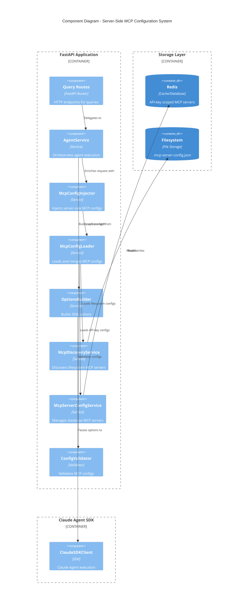
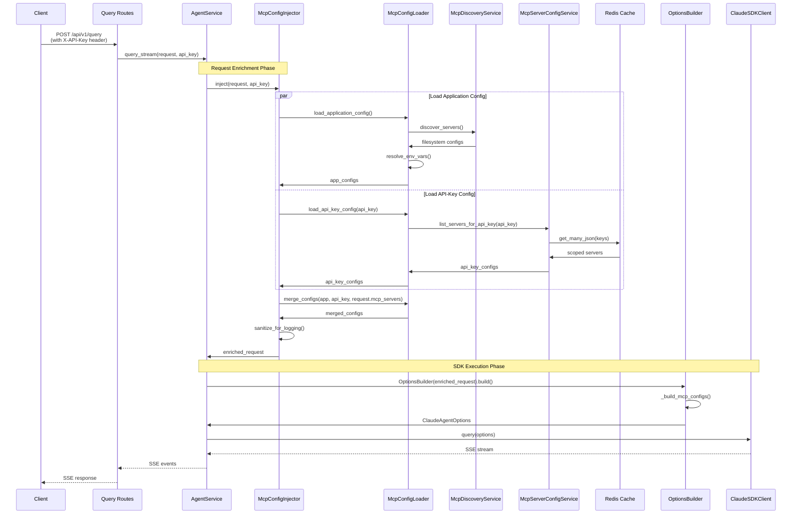

# Design: Server-Side MCP Server Configuration

## Overview

This design implements a **three-tier MCP server configuration system** (Application → API-Key → Request) that automatically provisions MCP servers to all API requests without requiring client-side configuration. The system leverages existing infrastructure (`McpDiscoveryService`, `McpServerConfigService`, `OptionsBuilder`) and extends them with:

1. **Application-level configuration loader** from `.mcp-server-config.json` file
2. **API-key scoped storage** in Redis with multi-tenant isolation
3. **Configuration merger** with clear precedence rules before SDK execution

The design prioritizes **backward compatibility** (100% existing test pass), **security** (command injection/SSRF prevention, credential sanitization), and **TDD workflow** (all components designed for test-first development).

## Architecture



## Components

### 1. McpConfigLoader (NEW)

**Purpose**: Central service for loading and merging MCP server configurations from all three tiers.

**Responsibilities**:
- Load application-level config from `.mcp-server-config.json` file at startup
- Resolve environment variable placeholders (`${VAR}`) server-side only
- Coordinate loading from filesystem discovery and database services
- Merge configurations with clear precedence: Application < API-Key < Request
- Cache application config in memory for performance

**Interfaces**:
```python
from pathlib import Path
from typing import Protocol

class McpConfigLoader(Protocol):
    """Loads and merges MCP server configurations."""

    def load_application_config(self) -> dict[str, McpServerInfo]:
        """Load application-level MCP servers from config file.

        Returns:
            Dict mapping server name to configuration.
            Returns empty dict if file missing or invalid.
        """
        ...

    async def load_api_key_config(
        self, api_key: str
    ) -> dict[str, McpServerInfo]:
        """Load API-key-scoped MCP servers from Redis.

        Args:
            api_key: API key for tenant scoping.

        Returns:
            Dict mapping server name to configuration.
        """
        ...

    def merge_configs(
        self,
        application: dict[str, McpServerInfo],
        api_key: dict[str, McpServerInfo],
        request: dict[str, McpServerConfigSchema] | None,
    ) -> dict[str, McpServerConfigSchema]:
        """Merge three tiers of configuration.

        Args:
            application: Application-level servers.
            api_key: API-key-level servers.
            request: Request-level servers (highest priority).

        Returns:
            Merged configuration with request > api_key > application precedence.
            Empty dict if request explicitly passes empty dict (opt-out).
        """
        ...

    def resolve_env_vars(self, config: dict[str, object]) -> dict[str, object]:
        """Resolve ${VAR} placeholders with server environment variables.

        Args:
            config: Config dict with possible ${VAR} placeholders.

        Returns:
            Config with placeholders replaced by os.environ values.

        Note:
            Only resolves from server environment, NEVER from user input.
        """
        ...
```

### 2. McpConfigInjector (NEW)

**Purpose**: Injects server-side MCP servers into QueryRequest before SDK execution.

**Responsibilities**:
- Coordinate config loading from all tiers
- Enrich QueryRequest with merged MCP servers
- Log final merged configuration with sanitized credentials
- Handle opt-out mechanism (empty `mcp_servers: {}`)

**Interfaces**:
```python
class McpConfigInjector(Protocol):
    """Injects server-side MCP servers into requests."""

    async def inject(
        self,
        request: QueryRequest,
        api_key: str,
    ) -> QueryRequest:
        """Inject server-side MCP servers into request.

        Args:
            request: Original query request.
            api_key: API key for tenant scoping.

        Returns:
            Enriched request with merged MCP servers.

        Note:
            If request.mcp_servers is empty dict {}, returns request unchanged (opt-out).
            If request.mcp_servers is None, merges server-side configs.
        """
        ...
```

### 3. McpServerConfigService (EXTENDED)

**Purpose**: Extend existing service to support API-key scoping.

**New Methods**:
```python
class McpServerConfigService:
    """Extended MCP server config service with API-key scoping."""

    async def list_servers_for_api_key(
        self, api_key: str
    ) -> list[McpServerRecord]:
        """List MCP servers scoped to specific API key.

        Args:
            api_key: API key for filtering.

        Returns:
            List of MCP server records for this API key only.
        """
        ...

    async def create_server_for_api_key(
        self,
        api_key: str,
        name: str,
        transport_type: str,
        config: dict[str, object],
    ) -> McpServerRecord | None:
        """Create MCP server scoped to API key.

        Args:
            api_key: API key for scoping.
            name: Server name.
            transport_type: stdio, sse, or http.
            config: Server configuration.

        Returns:
            Created record or None if name conflict.
        """
        ...

    def _server_key(self, api_key: str, name: str) -> str:
        """Build scoped cache key for MCP server.

        Args:
            api_key: API key for scoping.
            name: Server name.

        Returns:
            Key in format: mcp_server:{api_key}:{name}
        """
        ...
```

### 4. ConfigValidator (NEW)

**Purpose**: Validate MCP server configurations for security vulnerabilities.

**Responsibilities**:
- Command injection detection (shell metacharacters)
- SSRF prevention (internal URL blocking)
- Null byte detection
- Environment variable placeholder validation

**Interfaces**:
```python
class ConfigValidator(Protocol):
    """Validates MCP server configurations."""

    def validate_config(self, config: dict[str, object]) -> None:
        """Validate MCP server configuration.

        Args:
            config: MCP server config to validate.

        Raises:
            ValueError: If config contains security issues.
        """
        ...

    def validate_command_injection(self, command: str | None) -> None:
        """Validate command for injection attacks.

        Args:
            command: Command string to validate.

        Raises:
            ValueError: If shell metacharacters detected.
        """
        ...

    def validate_ssrf(self, url: str | None) -> None:
        """Validate URL for SSRF attacks.

        Args:
            url: URL to validate.

        Raises:
            ValueError: If URL targets internal resources.
        """
        ...

    def sanitize_credentials(
        self, config: dict[str, object]
    ) -> dict[str, object]:
        """Sanitize credentials in config for logging/responses.

        Args:
            config: Config with possible sensitive data.

        Returns:
            Config with sensitive fields replaced by ***REDACTED***.
        """
        ...
```

### 5. OptionsBuilder (EXTENDED)

**Purpose**: Extend existing builder to use merged MCP configs from injector.

**Modifications**:
- `_build_mcp_configs()` now receives pre-merged configs from injector
- No changes to method signature (backward compatible)
- Environment variable resolution still disabled for user input (T140)

## Data Flow



### Data Flow Steps

1. **Request Reception**: Client sends query with `X-API-Key` header
2. **API Key Extraction**: Middleware extracts API key for tenant scoping
3. **Parallel Config Loading**:
   - Application config from `.mcp-server-config.json` (cached in memory)
   - API-key config from Redis (pattern: `mcp_server:{api_key}:*`)
4. **Configuration Merge**: Loader applies precedence rules (Application < API-Key < Request)
5. **Validation**: All merged configs validated for security issues
6. **Request Enrichment**: Original request updated with merged MCP servers
7. **SDK Options Building**: OptionsBuilder converts enriched request to SDK format
8. **SDK Execution**: Claude Agent SDK executes with full MCP server access

## Technical Decisions

| Decision | Options Considered | Choice | Rationale |
|----------|-------------------|--------|-----------|
| **Config File Format** | Environment variables, JSON env var, Config file, Database only | **Config file** (`.mcp-server-config.json`) | Clean separation, version control, supports comments, aligns with existing `.mcp.json` discovery pattern |
| **Config File Location** | Project root, `.claude/`, `/etc/` | **Project root** (`.mcp-server-config.json`) | Consistent with existing `.mcp.json` discovery, easy to locate, project-specific |
| **API-Key Scoping Strategy** | Index key with set, Prefix scan, Separate index per key | **Prefix pattern** (`mcp_server:{api_key}:{name}`) | Natural multi-tenancy, efficient lookup, clear ownership, no N+1 queries |
| **Merge Strategy** | Deep merge, Replace, Hybrid | **Replace** (same-name server completely overrides) | Simpler semantics, predictable behavior, no partial config states, easier to test |
| **Opt-Out Mechanism** | Null field, Empty dict, Special flag | **Empty dict** (`mcp_servers: {}`) | Explicit intent, backward compatible (null = use defaults), clear in API docs |
| **Environment Variable Resolution** | Client-side, Server-side, Both | **Server-side only** at load time | Security: prevents client from accessing server secrets (T140 requirement) |
| **Config Validation** | On load, On use, Both | **Both** (load + use) | Fail fast on startup (invalid file), defense in depth on use (database servers) |
| **Credential Sanitization** | Log redaction only, Response redaction only, Both | **Both** (logs + responses) | Comprehensive protection against leakage via any channel |
| **Caching Strategy** | No cache, In-memory, Redis | **In-memory** for application config, Redis for API-key | Application config static (reload = restart), API-key dynamic but cached by Redis TTL |
| **Testing Approach** | Integration-first, Unit-first, Contract-first | **Unit-first (TDD)** | Requirements emphasize TDD, unit tests enable RED-GREEN-REFACTOR, faster feedback |

## File Structure

| File | Action | Purpose |
|------|--------|---------|
| `apps/api/services/mcp_config_loader.py` | **Create** | Application-level config loader with env var resolution |
| `apps/api/services/mcp_config_injector.py` | **Create** | Request enrichment service for server-side MCP injection |
| `apps/api/services/mcp_config_validator.py` | **Create** | Security validation for MCP configs (command injection, SSRF) |
| `apps/api/services/mcp_server_configs.py` | **Modify** | Extend with API-key scoping methods (`_server_key` signature change) |
| `apps/api/services/agent/service.py` | **Modify** | Add `McpConfigInjector` dependency, call `inject()` before `OptionsBuilder` |
| `apps/api/routes/mcp_servers.py` | **Modify** | Filter list/create/update/delete by authenticated API key |
| `apps/api/config.py` | **Modify** | Add `mcp_config_file: str | None` field with default `.mcp-server-config.json` |
| `.mcp-server-config.json.example` | **Create** | Example application-level MCP config with comments |
| `tests/unit/services/test_mcp_config_loader.py` | **Create** | Unit tests for config loading and merging (TDD) |
| `tests/unit/services/test_mcp_config_injector.py` | **Create** | Unit tests for request enrichment (TDD) |
| `tests/unit/services/test_mcp_config_validator.py` | **Create** | Unit tests for security validation (TDD) |
| `tests/integration/test_server_side_mcp.py` | **Create** | Integration tests for end-to-end config injection |
| `tests/contract/test_server_side_mcp_contract.py` | **Create** | Contract tests for backward compatibility |

## Data Models

### Application Configuration File Schema

**File**: `.mcp-server-config.json` (project root)

```json
{
  "$schema": "http://json-schema.org/draft-07/schema#",
  "type": "object",
  "properties": {
    "mcpServers": {
      "type": "object",
      "description": "Application-level MCP server definitions",
      "patternProperties": {
        "^[a-zA-Z0-9_-]+$": {
          "type": "object",
          "properties": {
            "type": {
              "enum": ["stdio", "sse", "http"],
              "description": "Transport type"
            },
            "command": {
              "type": "string",
              "description": "Command to execute (stdio only)"
            },
            "args": {
              "type": "array",
              "items": {"type": "string"},
              "description": "Command arguments"
            },
            "url": {
              "type": "string",
              "format": "uri",
              "description": "Server URL (sse/http only)"
            },
            "headers": {
              "type": "object",
              "additionalProperties": {"type": "string"},
              "description": "HTTP headers (supports ${VAR} placeholders)"
            },
            "env": {
              "type": "object",
              "additionalProperties": {"type": "string"},
              "description": "Environment variables (supports ${VAR} placeholders)"
            },
            "enabled": {
              "type": "boolean",
              "default": true,
              "description": "Whether server is enabled"
            }
          },
          "required": ["type"]
        }
      }
    }
  }
}
```

**Example**:
```json
{
  "mcpServers": {
    "github": {
      "type": "stdio",
      "command": "npx",
      "args": ["-y", "@modelcontextprotocol/server-github"],
      "env": {
        "GITHUB_TOKEN": "${GITHUB_TOKEN}"
      },
      "enabled": true
    },
    "postgres": {
      "type": "stdio",
      "command": "mcp-server-postgres",
      "args": ["--connection", "${DATABASE_URL}"]
    },
    "slack": {
      "type": "sse",
      "url": "https://mcp.slack.com/v1/sse",
      "headers": {
        "Authorization": "Bearer ${SLACK_API_TOKEN}"
      },
      "enabled": false
    }
  }
}
```

### Redis Data Structures

**API-Key Scoped MCP Servers**:
```python
# Key Pattern: mcp_server:{api_key}:{server_name}
# Example: mcp_server:key-12345:github

{
  "id": "550e8400-e29b-41d4-a716-446655440000",
  "name": "github",
  "transport_type": "stdio",
  "command": "npx",
  "args": ["-y", "@modelcontextprotocol/server-github"],
  "url": null,
  "headers": {},
  "env": {
    "GITHUB_TOKEN": "***REDACTED***"  # Sanitized in responses
  },
  "enabled": true,
  "status": "active",
  "error": null,
  "created_at": "2026-01-15T17:00:00Z",
  "updated_at": null,
  "metadata": {},
  "resources": []
}

# Index Key (for listing): mcp_servers:index:{api_key}
# Type: Set
# Values: ["github", "postgres", "slack"]
```

**Index Structure Update**:
```python
# OLD (global index):
_INDEX_KEY = "mcp_servers:index"

# NEW (per-API-key index):
def _index_key(self, api_key: str) -> str:
    return f"mcp_servers:index:{api_key}"
```

### Pydantic Models

**ApplicationMcpConfig** (internal use):
```python
from pydantic import BaseModel, Field

class ApplicationMcpServerConfig(BaseModel):
    """Application-level MCP server configuration."""

    type: Literal["stdio", "sse", "http"] = "stdio"
    command: str | None = None
    args: list[str] = Field(default_factory=list)
    url: str | None = None
    headers: dict[str, str] = Field(default_factory=dict)
    env: dict[str, str] = Field(default_factory=dict)
    enabled: bool = True

class ApplicationMcpConfig(BaseModel):
    """Root configuration from .mcp-server-config.json."""

    mcp_servers: dict[str, ApplicationMcpServerConfig] = Field(
        default_factory=dict,
        alias="mcpServers"
    )

    model_config = {"populate_by_name": True}
```

## Error Handling

| Error Scenario | Handling Strategy | User Impact |
|----------------|-------------------|-------------|
| **Config file missing** | Log info, continue with empty application config | None - API-key and request configs still work |
| **Config file malformed JSON** | Log warning with parse error, continue with empty config | None - graceful degradation to other tiers |
| **Invalid server config in file** | Skip invalid server, log warning, continue with valid servers | Invalid servers excluded, valid servers work |
| **Environment variable missing** | Leave `${VAR}` placeholder unreplaced, log warning | MCP server may fail at runtime with clear error |
| **Redis unavailable** | Fail fast with 503 Service Unavailable | Client receives clear error, can retry |
| **API key has no scoped servers** | Return empty dict from `load_api_key_config()` | Falls back to application config |
| **Request explicitly opts out** | Skip server-side injection, return request unchanged | Client has full control via `mcp_servers: {}` |
| **Command injection detected** | Raise ValueError, reject request with 400 Bad Request | Security validation prevents exploitation |
| **SSRF detected** | Raise ValueError, reject request with 400 Bad Request | Security validation prevents internal access |
| **Merge conflict (same name)** | Higher tier completely replaces lower tier | Predictable precedence: Request > API-Key > Application |
| **Config validation fails at startup** | Log warning, skip invalid server, continue | Non-blocking startup, invalid config isolated |

## Edge Cases

- **Empty config file**: Treated same as missing file (empty application config)
- **Enabled=false in application config**: Server excluded from application tier merge
- **Request passes `null` vs `{}`**: `null` = use server-side configs, `{}` = opt-out completely
- **API key has server with same name as application**: API-key server completely replaces application server
- **Environment variable has `${}` in value**: Not a placeholder, literal value used
- **Circular environment variable reference**: Not supported, results in unreplaced placeholder
- **Config file world-readable**: Log warning at startup (security best practice)
- **Unicode in server names**: Supported (Redis keys are UTF-8), but alphanumeric + hyphen/underscore recommended
- **Very large config file (>1MB)**: Supported but logged as warning (consider splitting into API-key tier)
- **Concurrent updates to API-key config**: Last write wins (Redis atomic operations)

## Test Strategy

### Unit Tests (TDD - RED-GREEN-REFACTOR)

**Target Coverage**: ≥90% for all new services

#### McpConfigLoader Tests
```python
# tests/unit/services/test_mcp_config_loader.py

# AC-1.1: Application config loading
def test_load_application_config_success()  # RED: File doesn't exist yet
def test_load_application_config_missing_file()  # Graceful handling
def test_load_application_config_malformed_json()  # Log warning, empty dict

# AC-1.4: Environment variable resolution
def test_resolve_env_vars_success()  # RED: Function not implemented
def test_resolve_env_vars_missing_var()  # Leave placeholder, log warning
def test_resolve_env_vars_nested_objects()  # Deep resolution

# AC-1.6: Caching
def test_application_config_cached()  # Single file read verified

# AC-3.1: Merge precedence
def test_merge_configs_request_overrides_all()  # RED: Merge logic not implemented
def test_merge_configs_api_key_overrides_application()
def test_merge_configs_empty_request_opts_out()  # AC-3.4

# AC-3.2: Replacement semantics
def test_merge_configs_complete_replacement()  # Not deep merge
```

#### McpConfigInjector Tests
```python
# tests/unit/services/test_mcp_config_injector.py

# AC-3.5: Default behavior
def test_inject_with_null_request_mcp_servers()  # Uses server-side
def test_inject_with_empty_dict_opts_out()  # AC-3.4

# AC-3.6: Logging
def test_inject_logs_sanitized_config()  # Credentials redacted

# AC-5.1: OpenAI compatibility
def test_inject_includes_server_side_mcp_in_openai_requests()
```

#### McpConfigValidator Tests
```python
# tests/unit/services/test_mcp_config_validator.py

# AC-4.3: Command injection
def test_validate_command_injection_detected()  # RED: Validator not implemented
def test_validate_command_injection_safe_command()

# AC-4.4: SSRF protection
def test_validate_ssrf_internal_ip()  # RED: SSRF check not implemented
def test_validate_ssrf_localhost()
def test_validate_ssrf_metadata_endpoint()
def test_validate_ssrf_valid_url()

# AC-4.2: Credential sanitization
def test_sanitize_credentials_env_vars()
def test_sanitize_credentials_headers()
```

#### McpServerConfigService Tests (Extended)
```python
# tests/unit/services/test_mcp_server_configs.py

# AC-2.2: API-key scoping
def test_server_key_includes_api_key()  # Pattern: mcp_server:{api_key}:{name}

# AC-2.3: Isolation
def test_list_servers_for_api_key_isolation()  # No cross-tenant access

# AC-2.6: Creation with API key
def test_create_server_for_api_key()
```

### Integration Tests

**Target Coverage**: ≥80% for end-to-end flows

```python
# tests/integration/test_server_side_mcp.py

# AC-1.7: Application-level injection
async def test_application_mcp_servers_injected_into_query()
async def test_application_mcp_server_tools_available()

# AC-2.4: API-key override
async def test_api_key_mcp_overrides_application()

# AC-3.3: Backward compatibility
async def test_request_mcp_servers_unchanged()  # Existing behavior preserved

# AC-5.3: OpenAI endpoint integration
async def test_openai_chat_completions_includes_server_side_mcp()

# Multi-tier scenarios
async def test_three_tier_merge_precedence()
async def test_opt_out_mechanism_disables_server_side_mcp()
```

### Contract Tests

**Target**: 100% backward compatibility with existing API contracts

```python
# tests/contract/test_server_side_mcp_contract.py

# AC-3.3: Backward compatibility
def test_existing_query_tests_pass_unchanged()
def test_existing_mcp_tests_pass_unchanged()
def test_existing_openai_tests_pass_unchanged()

# New contract guarantees
def test_application_config_always_loaded()
def test_api_key_config_scoped_correctly()
def test_opt_out_mechanism_honored()
```

### E2E Tests

```python
# tests/e2e/test_server_side_mcp_e2e.py

# End-to-end user scenarios
async def test_e2e_new_api_key_gets_application_mcp_servers()
async def test_e2e_api_key_with_custom_servers_merges_correctly()
async def test_e2e_request_override_replaces_all()
async def test_e2e_openai_client_uses_mcp_tools_automatically()
```

### Performance Tests

```python
# tests/performance/test_server_side_mcp_performance.py

# NFR-1: Config load performance
def test_application_config_load_time_under_100ms()

# NFR-2: Redis query performance
async def test_api_key_config_load_time_under_10ms()

# No latency increase
async def test_request_without_server_side_mcp_no_overhead()
```

### Security Tests

```python
# tests/security/test_server_side_mcp_security.py

# AC-4.1: Server-side only env var resolution
def test_client_cannot_inject_env_vars()

# AC-4.3: Command injection
def test_command_injection_rejected()

# AC-4.4: SSRF prevention
def test_ssrf_attempts_blocked()

# AC-2.3: Multi-tenant isolation
async def test_api_key_cannot_access_other_tenant_servers()
```

## Security Design

### Credential Handling

**Server-Side Environment Variables Only**:
```python
# apps/api/services/mcp_config_loader.py

def resolve_env_vars(self, config: dict[str, object]) -> dict[str, object]:
    """Resolve ${VAR} placeholders from SERVER environment only.

    CRITICAL: This function ONLY reads from os.environ (server-side).
    Client-provided values are NEVER used for resolution.

    Security Constraint: AC-4.1 (T140)
    """
    pattern = re.compile(r'\$\{([A-Z_][A-Z0-9_]*)\}')

    def replace(match: re.Match) -> str:
        var_name = match.group(1)
        value = os.environ.get(var_name)
        if value is None:
            logger.warning(
                "env_var_not_found",
                variable=var_name,
                hint="Placeholder will remain unreplaced"
            )
            return match.group(0)  # Leave placeholder
        return value

    # Recursively resolve in strings
    # ... (implementation details)
```

**Credential Sanitization**:
```python
# apps/api/services/mcp_config_validator.py

def sanitize_credentials(
    self, config: dict[str, object]
) -> dict[str, object]:
    """Redact sensitive fields for logging and API responses.

    Sensitive Patterns:
    - env: api_key, apikey, secret, password, token, auth, credential
    - headers: auth, token, authorization

    Security Constraint: AC-4.2
    """
    SENSITIVE_PATTERNS = [
        "api_key", "apikey", "secret", "password",
        "token", "auth", "credential", "authorization"
    ]

    sanitized = dict(config)

    if "env" in sanitized and isinstance(sanitized["env"], dict):
        sanitized["env"] = self._sanitize_mapping(
            sanitized["env"], SENSITIVE_PATTERNS
        )

    if "headers" in sanitized and isinstance(sanitized["headers"], dict):
        sanitized["headers"] = self._sanitize_mapping(
            sanitized["headers"], SENSITIVE_PATTERNS
        )

    return sanitized
```

### Multi-Tenant Isolation

**Redis Key Scoping**:
```python
# apps/api/services/mcp_server_configs.py

def _server_key(self, api_key: str, name: str) -> str:
    """Build scoped cache key for MCP server.

    Pattern: mcp_server:{api_key}:{server_name}

    Security: Ensures tenant isolation at Redis key level.
    Cross-tenant access impossible without API key.

    Example: mcp_server:key-12345:github
    """
    return f"mcp_server:{api_key}:{name}"

def _index_key(self, api_key: str) -> str:
    """Build scoped index key for listing servers.

    Pattern: mcp_servers:index:{api_key}
    """
    return f"mcp_servers:index:{api_key}"
```

**Route-Level Filtering**:
```python
# apps/api/routes/mcp_servers.py

@router.get("", response_model=McpServerListResponse)
async def list_mcp_servers(
    api_key: ApiKey,  # Extracted from X-API-Key header
    cache: Cache,
) -> McpServerListResponse:
    """List MCP servers - filtered by authenticated API key."""
    service = McpServerConfigService(cache)

    # ONLY return servers scoped to this API key
    servers = await service.list_servers_for_api_key(api_key)

    # Never return servers from other API keys
    return McpServerListResponse(servers=servers)
```

### Validation Strategy

**Defense in Depth**:
1. **Startup Validation**: Application config validated at load time
2. **Request Validation**: Pydantic schemas validate structure
3. **Pre-Merge Validation**: All configs validated before merge
4. **Pre-SDK Validation**: Final validation before passing to SDK

**Command Injection Prevention** (AC-4.3):
```python
# Reuse existing validator from apps/api/schemas/validators.py
SHELL_METACHAR_PATTERN = re.compile(r"[;&|`$(){}[\]<>!\n\r\\]")

if SHELL_METACHAR_PATTERN.search(command):
    raise ValueError(
        "Shell metacharacters not allowed in command. "
        "Use 'args' for command arguments."
    )
```

**SSRF Prevention** (AC-4.4):
```python
# Reuse existing validator from apps/api/schemas/validators.py
def validate_url_not_internal(url: str) -> str:
    """Block private IPs, loopback, link-local, cloud metadata."""
    parsed = urlparse(url)
    hostname = parsed.hostname

    # Blocked hostnames
    if hostname.lower() in ("localhost", "metadata.google.internal"):
        raise ValueError("Internal URLs not allowed")

    # IP address checks
    ip = ipaddress.ip_address(hostname)
    if ip.is_private or ip.is_loopback or ip.is_link_local:
        raise ValueError("Internal URLs not allowed")

    return url
```

## Implementation Phases

### Phase 1: Core Infrastructure (Days 1-2)

**Goals**: Implement config loading and merging with comprehensive unit tests.

**Tasks**:
1. **TDD: McpConfigLoader** (RED-GREEN-REFACTOR)
   - Write failing tests for `load_application_config()`
   - Implement JSON parsing and schema validation
   - Write failing tests for `resolve_env_vars()`
   - Implement environment variable resolution
   - Write failing tests for `merge_configs()`
   - Implement merge logic with precedence
   - Refactor for clarity

2. **TDD: ConfigValidator** (RED-GREEN-REFACTOR)
   - Write failing tests for command injection detection
   - Implement SHELL_METACHAR_PATTERN validation
   - Write failing tests for SSRF prevention
   - Implement internal URL blocking
   - Write failing tests for credential sanitization
   - Implement sensitive field redaction
   - Refactor for reusability

3. **Extend Settings**
   - Add `mcp_config_file` field to `apps/api/config.py`
   - Default: `.mcp-server-config.json`
   - Unit tests for config loading

**Checkpoint**: ≥90% unit test coverage, `ty check` passes, all tests green.

### Phase 2: API-Key Scoping (Day 3)

**Goals**: Extend database service with multi-tenant isolation.

**Tasks**:
1. **TDD: McpServerConfigService Extension**
   - Write failing tests for `_server_key()` with api_key parameter
   - Implement scoped key pattern: `mcp_server:{api_key}:{name}`
   - Write failing tests for `list_servers_for_api_key()`
   - Implement Redis key filtering by API key
   - Write failing tests for `create_server_for_api_key()`
   - Implement scoped creation
   - Refactor index key management

2. **Update Routes**
   - Modify `list_mcp_servers()` to filter by `api_key`
   - Modify `create_mcp_server()` to scope by `api_key`
   - Update all CRUD operations with API-key scoping
   - Integration tests for multi-tenant isolation

**Checkpoint**: ≥90% unit test coverage, isolation tests pass, no cross-tenant access.

### Phase 3: Request Enrichment (Day 4)

**Goals**: Inject server-side MCP configs into queries.

**Tasks**:
1. **TDD: McpConfigInjector**
   - Write failing tests for `inject()` method
   - Implement config loading coordination
   - Write failing tests for opt-out mechanism
   - Implement empty dict detection
   - Write failing tests for logging
   - Implement sanitized logging
   - Refactor for testability

2. **Integrate with AgentService**
   - Add `McpConfigInjector` as dependency
   - Call `inject()` before `OptionsBuilder`
   - Update integration tests
   - Verify backward compatibility

3. **Create Example Config**
   - Write `.mcp-server-config.json.example`
   - Add comments and documentation
   - Include all transport types

**Checkpoint**: ≥80% integration test coverage, existing tests pass (100% backward compatibility).

### Phase 4: OpenAI Integration & Testing (Day 5)

**Goals**: Verify OpenAI compatibility and comprehensive testing.

**Tasks**:
1. **OpenAI Endpoint Testing**
   - Integration tests for `/v1/chat/completions` with server-side MCP
   - Verify tool availability without client config
   - Contract tests for OpenAI compliance

2. **Contract Tests**
   - Run full existing test suite
   - Verify 100% backward compatibility
   - Document any breaking changes (should be none)

3. **E2E Testing**
   - Real MCP server execution
   - Multi-tier config scenarios
   - Performance benchmarking

4. **Documentation**
   - Update `CLAUDE.md` with server-side MCP instructions
   - API documentation updates
   - Migration guide for existing users

**Checkpoint**: All tests pass (unit/integration/contract/e2e), documentation complete.

### Phase 5: Security Review & Performance Optimization (Day 6)

**Goals**: Security audit and performance tuning.

**Tasks**:
1. **Security Audit**
   - Penetration testing for command injection
   - SSRF fuzzing with internal URLs
   - Multi-tenant isolation verification
   - Credential leakage scanning (logs, responses)

2. **Performance Optimization**
   - Verify config load time <100ms
   - Verify Redis lookup time <10ms
   - Benchmark with large configs (100+ servers)
   - Add caching if needed

3. **Production Readiness**
   - File permission checks at startup
   - Monitoring/alerting recommendations
   - Runbook for common issues
   - Deployment checklist

**Checkpoint**: Zero security vulnerabilities, performance targets met, production-ready.

## Performance Considerations

- **Application Config Caching**: Load `.mcp-server-config.json` once at startup, cache in memory (no file reads per request)
- **Redis Connection Pooling**: Reuse existing Redis adapter with connection pool (no per-request connection overhead)
- **Parallel Config Loading**: Load application and API-key configs concurrently (use `asyncio.gather()`)
- **Lazy Validation**: Skip validation if request explicitly opts out (avoid unnecessary work)
- **Config Size Limits**: Log warning if application config >1MB or API-key config >100 servers (recommend optimization)
- **Merge Optimization**: Dict replacement (not deep merge) for O(n) complexity, not O(n*m)

**Performance Targets** (NFR-1, NFR-2):
- Application config load: <100ms (file read + JSON parse + validation)
- API-key config load: <10ms (Redis batch get)
- Merge operation: <1ms (dictionary update)
- No measurable overhead for requests with `mcp_servers: {}` (opt-out)

## Existing Patterns to Follow

Based on codebase analysis:

### 1. Protocol-Based Abstractions
```python
# apps/api/protocols.py pattern
from typing import Protocol

class McpConfigLoader(Protocol):
    """Define interface, implement in services."""
    def load_application_config(self) -> dict[str, McpServerInfo]: ...
```

### 2. Dependency Injection via FastAPI
```python
# apps/api/dependencies.py pattern
from typing import Annotated
from fastapi import Depends

def get_mcp_config_loader() -> McpConfigLoader:
    settings = get_settings()
    discovery = McpDiscoveryService()
    return McpConfigLoaderImpl(settings, discovery)

McpLoader = Annotated[McpConfigLoader, Depends(get_mcp_config_loader)]
```

### 3. Structured Logging with Correlation IDs
```python
# apps/api/services pattern
import structlog

logger = structlog.get_logger(__name__)

logger.info(
    "mcp_config_loaded",
    source="application",
    server_count=len(servers),
    file_path=str(config_path),
)
```

### 4. Pydantic Validation Schemas
```python
# apps/api/schemas pattern
from pydantic import BaseModel, Field, field_validator

class ApplicationMcpServerConfig(BaseModel):
    type: Literal["stdio", "sse", "http"] = "stdio"
    command: str | None = None

    @field_validator("command")
    @classmethod
    def validate_command_security(cls, v: str | None) -> str | None:
        if v and SHELL_METACHAR_PATTERN.search(v):
            raise ValueError("Shell metacharacters not allowed")
        return v
```

### 5. Google-Style Docstrings
```python
def load_application_config(self) -> dict[str, McpServerInfo]:
    """Load application-level MCP servers from config file.

    Reads .mcp-server-config.json from project root, validates schema,
    resolves environment variables, and returns parsed configurations.

    Returns:
        Dict mapping server name to configuration. Returns empty dict
        if file is missing or invalid (logs warning but doesn't fail).

    Raises:
        RuntimeError: If config file exists but is unreadable due to
                     permissions (not a validation error).
    """
```

### 6. Type Safety (Zero `Any`)
```python
# NEVER use Any - use specific types or TypedDict
from typing import TypedDict

class McpServerInfo(TypedDict, total=False):
    name: str
    type: Literal["stdio", "sse", "http"]
    command: str | None
    # ... explicit types for all fields
```

### 7. Async/Await for I/O
```python
# All Redis operations are async
async def load_api_key_config(self, api_key: str) -> dict[str, McpServerInfo]:
    servers = await self._db_service.list_servers_for_api_key(api_key)
    return self._convert_to_info(servers)
```

---

## Learnings Append

This design revealed several architectural insights that will inform implementation:

- **Configuration Loader as Coordinator**: The `McpConfigLoader` acts as the central coordinator for all three tiers, avoiding tight coupling between filesystem, database, and request sources.

- **Validation at Multiple Layers**: Security validation occurs at three points (load, merge, SDK pass) providing defense in depth without performance penalty (cached results).

- **Opt-Out Mechanism Critical**: Empty dict `{}` vs `null` distinction provides explicit control without breaking existing behavior - this was a key design decision for backward compatibility.

- **API-Key Scoping Pattern Reusable**: The `mcp_server:{api_key}:{name}` Redis key pattern is a clean multi-tenancy solution applicable to other scoped resources.

- **TDD-Friendly Architecture**: Separating concerns into small, focused services (`Loader`, `Injector`, `Validator`) makes unit testing straightforward and enables true RED-GREEN-REFACTOR workflow.

- **Performance vs Security Tradeoff**: Environment variable resolution at load time (cached) balances security (T140 requirement) with performance (no per-request resolution overhead).

- **Existing Infrastructure Leverage**: Reusing `McpDiscoveryService`, `McpServerConfigService`, and security validators from `schemas/validators.py` reduces implementation scope significantly.

- **Integration Point Minimal**: Only one integration point in `AgentService` (before `OptionsBuilder`) keeps changes localized and reduces risk of breaking existing flows.

- **Type Safety Enables Refactoring**: Explicit `TypedDict` for `McpServerInfo` and Pydantic models for validation schemas make merge logic type-safe and refactor-friendly.

- **Backward Compatibility Testing First**: Contract tests verifying existing test suite passes unchanged (NFR-7) should be written in Phase 1, not Phase 4, to catch breaking changes early.
